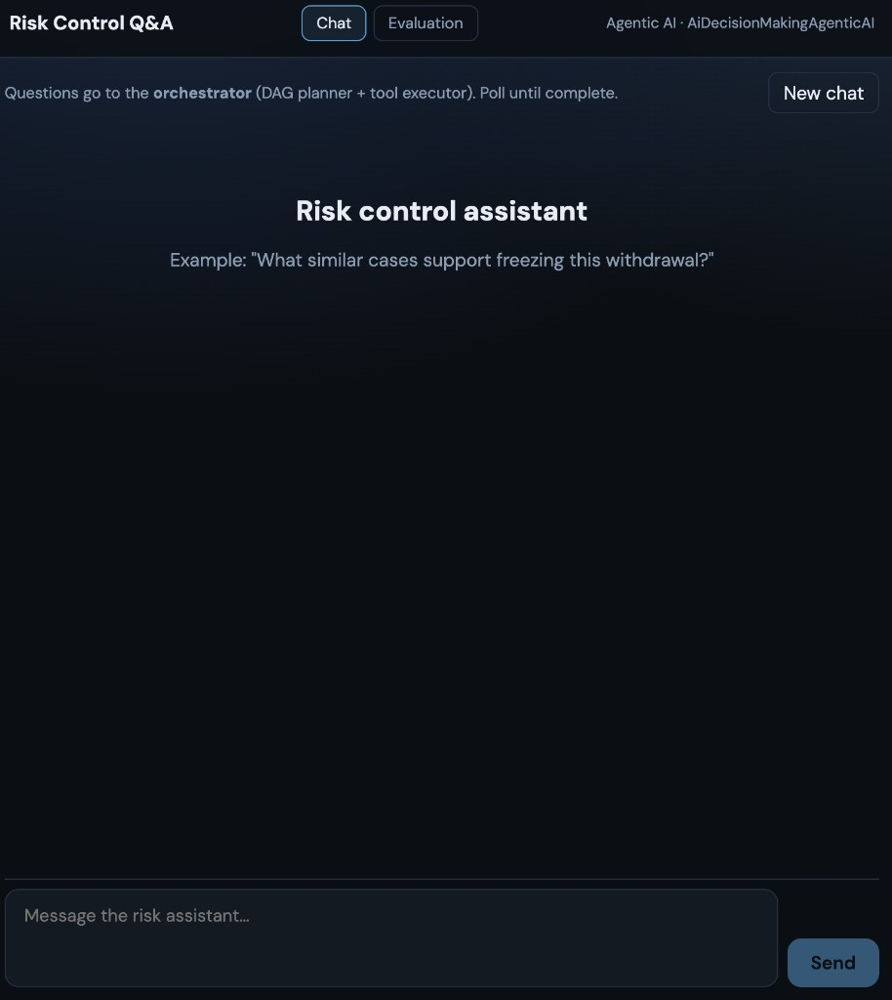
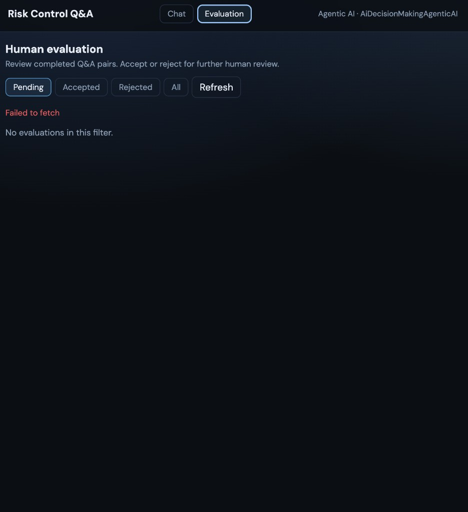
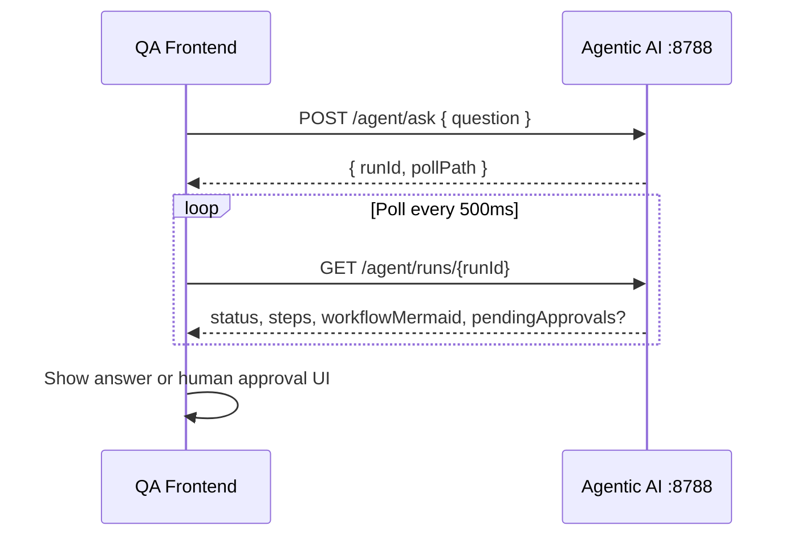

# AI Decision Making — QA Frontend

ChatGPT-style **risk control Q&A** UI for the agentic orchestrator. Built with **Vite + React** and deployed to Azure Static Web Apps **`ai-rag-agentic-qa`**.

Backend: **[AiDecisionMakingAgenticAI](https://github.com/michaelgsx/AiDecisionMakingAgenticAI)** (Spring Boot, port **8788**).

> **Synthetic data:** Example questions, demo answers, and evaluation rows are AI-generated for illustration only.

## Screenshots

### Chat tab

Orchestrator Q&A: submit a question, poll until the DAG completes, thumbs feedback on answers.



### Evaluation tab

Human review queue: filter by Pending / Accepted / Rejected, then **Accept** or **Reject** each Q&A pair.



## Features

| Tab | Purpose |
|-----|---------|
| **Chat** | Submit questions → orchestrator plans a DAG → poll until complete; **workflow diagram** (Mermaid) updates live |
| **Evaluation** | Human review queue: list Q&A pairs, **Accept** / **Reject** for further review |

Additional behaviour:

- **Thumbs up / down** on assistant answers → `POST /agent/feedback`
- **In-run approval** when workflow uses `human_in_the_loop` (Accept / Reject panel while polling)
- **New chat** clears the local conversation
- **Mock mode** — no backend required (`VITE_USE_MOCK=true`)

## Architecture (client flow)



Evaluation tab:

```text
GET  /agent/evaluations?status=pending
POST /agent/evaluations/{evaluationId}/review  { decision: accept|reject }
```

## Quick start

**Prerequisites:** Node 20+, agentic API running locally (or mock mode).

```bash
npm ci
cp .env.example .env
npm run dev
```

Open http://localhost:5174

### Environment (`.env`)

| Variable | Description |
|----------|-------------|
| `VITE_AGENT_API_BASE_URL` | Agentic API root, e.g. `http://localhost:8788` (no trailing slash) |
| `VITE_OPS_TOKEN` | Optional Bearer token; must match backend `OPS_TOKEN` when set |
| `VITE_USE_MOCK` | `true` = skip network calls (demo UI only) |

**If Evaluation shows “Failed to fetch”:**

1. Confirm `VITE_AGENT_API_BASE_URL` points at a reachable API (not empty).
2. Start the agentic backend (`./mvnw spring-boot:run` in `AiDecisionMakingAgenticAI/backend`).
3. Apply DB migrations on `ai-rag-db-1` (see agentic README).
4. Match `VITE_OPS_TOKEN` with backend `OPS_TOKEN`, or leave both blank for local dev.
5. Check browser devtools → CORS: backend `CORS_ORIGINS` must include `http://localhost:5174`.

## Scripts

| Command | Description |
|---------|-------------|
| `npm run dev` | Dev server (port 5174) |
| `npm run build` | Production build → `dist/` |
| `npm run preview` | Preview production build |
| `npm test` | Unit tests (Vitest + Testing Library) |
| `npm run test:watch` | Tests in watch mode |

## Project layout

```text
src/
  pages/
    ChatPage.tsx          # Orchestrator ask + poll + feedback
    EvaluationPage.tsx    # Human review queue
  api/client.ts           # API client (ask, poll, evaluations, feedback)
  components/             # ChatMessage, HumanApprovalPanel, WorkflowDiagram, FeedbackBar
```

## Azure deploy

| Item | Value |
|------|--------|
| SWA resource | `ai-rag-agentic-qa` |
| SWA URL | `https://yellow-island-0fefe051e.7.azurestaticapps.net` |
| Key Vault | `ai-rag-key` |
| Deploy token secret | `ai-rag-agentic-qa` |

**Workflows**

| Branch | Workflow | Deploy token source |
|--------|----------|---------------------|
| `v1` | `.github/workflows/azure-static-web-apps-yellow-island-0fefe051e.yml` | Key Vault `ai-rag-key` / `ai-rag-agentic-qa` |
| `main` / manual | `.github/workflows/deploy-qa-swa.yml` | Same |

Both workflows pre-build with `npm run build`, then upload `dist/` with `skip_app_build: true`.

**GitHub Actions secrets**

| Secret | Purpose |
|--------|---------|
| `AZURE_CREDENTIALS` | Service principal JSON for `az login`: `{ "tenantId", "clientId", "clientSecret" }` (subscriptionId optional) |
| `AZURE_KEYVAULT_NAME` | Optional repository variable or secret; **vault name only** `ai-rag-key` — not credentials |
| `VITE_AGENT_API_BASE_URL` | `https://ai-rag-agentic-ai-h4c6ccfddad5dnd2.westus2-01.azurewebsites.net` |
| `VITE_OPS_TOKEN` | Same as App Service `OPS_TOKEN` (optional) |

The SP needs **Key Vault Secrets User** on `ai-rag-key`. Do not use the old `AZURE_STATIC_WEB_APPS_API_TOKEN_*` GitHub secret.

## Related repos

| Repo | Role |
|------|------|
| **AiDecisionMakingAgenticAI** | Orchestrator API, tools, DB migrations |
| AiDecisionMakingBackend | Ingest / Assess RAG (`POST /rag/assess`) |
| AiDecisionMakingFrontend | Risk ingest & assess console |
